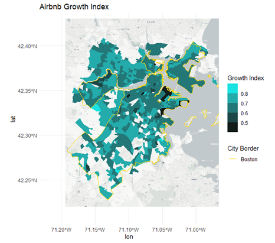
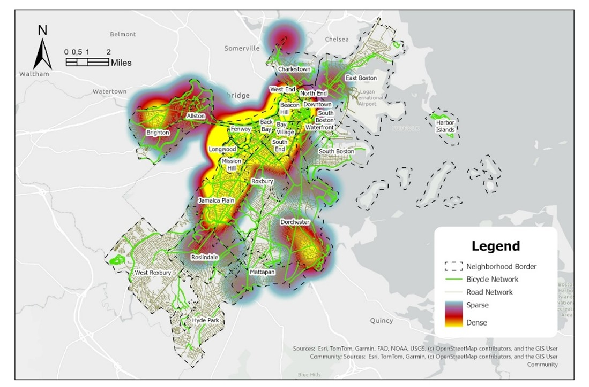
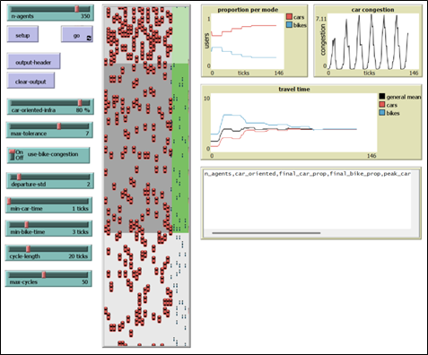

# Mahbub R Maulaa

### Urban Data Analyst and Writer

# About Me:
I am a Research Assistant at the Boston Area Research Initiative (BARI) and a founder of Curiocity Indonesia. My research focus extends to a wide range of topics, including climate issues, housing, transportation, and community development. 

# Education:
## Northeastern University – April 2026
## Institut Teknologi Bandung – Oktober 2019

# Experience:
## Boston Area Research Initiative (BARI) – Research Assistant (Jan 2025—April 2026)
## NUDP World Bank-PT Lenggogeni-MoHA Indonesia – Development Planning Assistant (March 2023—June 2024)
## Ruang Waktu Knowledge Hub – Knowledge Worker (May 2022—June 2024)
## Pikiran Rakyat Media Network – Journalist (Dec 2019—July 2021)
## Institute for Transportation and Development Policy (ITDP) – Intern (April 2019—Oct 2019)

# Projects
## Evaluating the Effect of Short-Term Rental (STR) Program on Airbnb Growth in Boston (2019-2022) 

**Airbnb Growth Index in Greater Boston Area (2019-2022)**

To curb the negative impact of Airbnb on housing stocks, the City of Boston imposed a Short-Term Rental (STR) Program in 2019. This project assesses the effectiveness of the STR Program in controlling the growth of Airbnb in Boston in comparison to other neighboring towns across the Greater Boston Area. Furthermore, the project investigates a deeper analysis of Blue Hill Ave, where the Common SENSE project is implemented to examine environmental justice. This neighborhood could become an example of how effective this policy can be.

This project uses quantitative methods. The descriptive statistics method is used to break down the demographic, property value, and Airbnb information throughout the years. To compare the growth index between Boston and other cities, the project used inferential statistics, specifically the student’s t-test method. For Airbnb growth predictions, I used a regression model with four independent variables: new condominium development, property value growth, the rates of property value growth, and median household income.

We observe that the growth of Airbnb listings, prices, and availability/occupancy in Boston City is slower than in other neighboring towns in Greater Boston. Furthermore, the specific restrictions in this program have successfully reduced the growth index of the home-sharing industry in Boston’s public housing areas. The City of Boston has successfully implemented the STR Program to mitigate the housing crisis while maintaining the benefits of the gig economy. Brookline, another neighboring town, replicated this policy in 2021, and its results may not be reflected in this study. Our analysis can also help Boston residents, especially those in the Blue Hill Ave community, understand the impact of this policy on urban justice.

## Identifying Critical Bike Network Improvement for Boston’s Vision Zero 2030

**Vision Zero 2030: Bike-related Safety Concerns**

*Data source: Analyze Boston and BARI, 2023*

Bike accidents in Boston have increased throughout the years. Department of Transportation of the Commonwealth of Massachusetts (MassDOT) reported 113 crashes in 2024, which increased 36.14% from the previous year. This situation could be a critical problem for Boston, which aims to reduce traffic accidents by 2030. Beyond vision zero, Boston also aims to achieve better cycling accessibility by 2030. They plan to improve the network by fourfold to increase bike commuters. To achieve both goals, the City of Boston needs to build an improvement plan for bike networks with a defined priority, which can be generated by utilizing GIS.

Using GIS methods, we analyze the heatmap of bike-related accidents in Boston, overlayed with the current bike network. As the aim of this project is to improve the physical design of bike infrastructure, we prioritize the network with design problems.

There are 6 clusters of improvement priority for Boston’s bike network: Brighton, additional connection between local streets and the Paul Dudley White Bike Path; Downtown Boston, connectivity between major streets; Jamaica Pond, coastline bike path; Field Corner, disconnected bike path; William T Morrisey Boulevard, additional connection to a bike crossing; and Neponset River Bike Path, additional connection to local streets.

## Influence of Bike Infrastructure on Car Congestion, Travel Times and Mode Choice 

**Bike infrastructure modelling in Netlogo**

How does car-favorable vs. bike-favorable infrastructure impact congestion and travel time, and thus people’s decision to choose sustainable transportation modes? By modeling these scenarios in Netlogo, we can better evaluate and understand emerging patterns from existing transportation planning policies. This question explores how individuals and systems respond to different mobility policies under changing conditions. 

This project uses agent-based modeling as a methodology to identify those changes under three different scenarios: expanding bike infrastructure, varying departure times, and the implementation of protected bike lanes.  The agent-based modeling allows us to simulate dedicated bike lanes and assess how infrastructure and policy decisions impact congestion and travel times, and thus individuals’ decisions to choose sustainable transportation methods. 

To encourage sustainable transportation, particularly bikes, the city government should reallocate more street space for bike infrastructure, pair the expansion with flexible work policies, and invest in more protected bike lanes when the city cannot provide a bigger street proportion to bikes.

# Book and Articles

**Article on Academic Journal**
Sarosa, W., Susetyo, N. A., Aulianisa, M. N., Maulaa, M. R., & Giffary, P. (2023). FOSTERING HUMAN DIMENSION OF SMART CITIES: Lessons from Jakarta for Nusantara, Indonesia’s New Capital City in the Making. Smart City, 2(2), 4.

**Books**
Sarosa, W., Kusuma, E. D., Aulianisa, M. N., Susetyo, N. A., Maulaa, M. R., & Giffary, P. (2024). Kota Tangguh Pasca Korona: Urgensi Resiliensi Kota di Era Ketidakpastian. Bandung: Expose Mizan.

Sarosa, W., Kusuma, E. D., Aulianisa, M. N., Susetyo, N. A., Maulaa, M. R., & Giffary, P. (2024). Coretan Ringkas Tentang Kota: Catatan untuk Kota Berkelanjutan. Jakarta: Ruang Waktu Knowledge Hub.

**Undergraduate Thesis**
Maulaa, M. R. (2019). Operasionalisasi Konsep Shared Street (Studi Kasus: Kampung Kota RW O2 Tugu Selatan, Koja, Jakarta Utara) (The Operationalization of Shared Street Concept (Case Study: Kampung Kota RW 02 South Tugu, Koja, North Jakarta)). Undergraduate Thesis. Bandung: ITB

# Skills and Language

**Skills**: Proficient in ArcGIS Pro, Microsoft Word, Excel, PowerPoint, Canva, CorelDraw/Adobe Illustrator/Affinity. Familiar with R Studio, SPSS, Tableau, Videographic applications 

**Language**: English, Bahasa Indonesia, Sundanese, Javanese 
